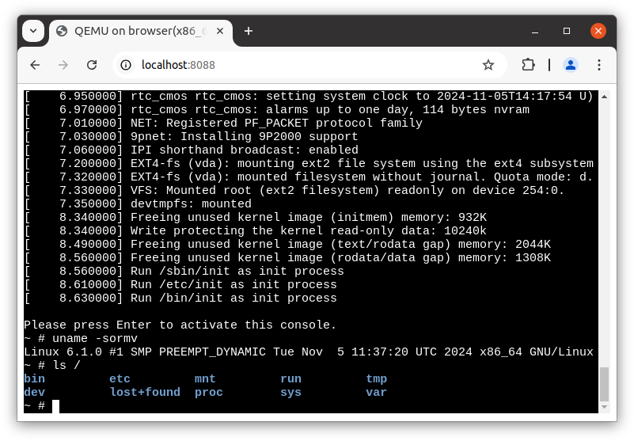
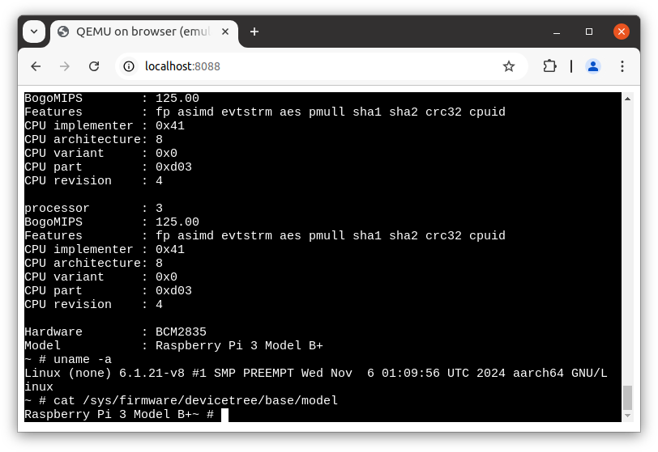

# QEMU Wasm

This is a patched QEMU to make it runnable inside the browser.
JIT binary translation (TCG) with multi-thread support (Multi-Threaded TCG) is also enabled.
x86_64 and AArch64 guests are enabled as of now, but more will be enabled in the future.

This is an experimental software.

Demo page of QEMU on browser: https://ktock.github.io/qemu-wasm-demo/

## Building

QEMU depends on several libraries including glib.
[Dockerfile](./Dockerfile) in this repo contains dependencies compiled with emscripten.
You can use this container for compiling QEMU with emscripten as well.

```console
$ docker build -t buildqemu - < Dockerfile
$ docker run --rm -d --name build-qemu-wasm -v $(pwd):/qemu/:ro buildqemu
```

For building `qemu-system-x86_64` (x86_64 guest):

```console
$ EXTRA_CFLAGS="-O3 -g -Wno-error=unused-command-line-argument -matomics -mbulk-memory -DNDEBUG -DG_DISABLE_ASSERT -D_GNU_SOURCE -sASYNCIFY=1 -pthread -sPROXY_TO_PTHREAD=1 -sFORCE_FILESYSTEM -sALLOW_TABLE_GROWTH -sTOTAL_MEMORY=2GB -sWASM_BIGINT -sMALLOC=mimalloc --js-library=/build/node_modules/xterm-pty/emscripten-pty.js -sEXPORT_ES6=1 -sASYNCIFY_IMPORTS=ffi_call_js" ; \
  docker exec -it build-qemu-wasm emconfigure /qemu/configure --static --target-list=x86_64-softmmu --cpu=wasm32 --cross-prefix= \
    --without-default-features --enable-system --with-coroutine=fiber \
    --extra-cflags="$EXTRA_CFLAGS" --extra-cxxflags="$EXTRA_CFLAGS" --extra-ldflags="-sEXPORTED_RUNTIME_METHODS=getTempRet0,setTempRet0,addFunction,removeFunction,TTY" && \
  docker exec -it build-qemu-wasm emmake make -j $(nproc) qemu-system-x86_64
```

For building `qemu-system-aarch64` (AArch64 guest):

```console
$ EXTRA_CFLAGS="-O3 -g -Wno-error=unused-command-line-argument -matomics -mbulk-memory -DNDEBUG -DG_DISABLE_ASSERT -D_GNU_SOURCE -sASYNCIFY=1 -pthread -sPROXY_TO_PTHREAD=1 -sFORCE_FILESYSTEM -sALLOW_TABLE_GROWTH -sTOTAL_MEMORY=2GB -sWASM_BIGINT -sMALLOC=mimalloc --js-library=/build/node_modules/xterm-pty/emscripten-pty.js -sEXPORT_ES6=1 " ; \
  docker exec -it build-qemu-wasm emconfigure /qemu/configure --static --target-list=aarch64-softmmu --cpu=wasm32 --cross-prefix= \
    --without-default-features --enable-system --with-coroutine=fiber \
    --extra-cflags="$EXTRA_CFLAGS" --extra-cxxflags="$EXTRA_CFLAGS" --extra-ldflags="-sEXPORTED_RUNTIME_METHODS=getTempRet0,setTempRet0,addFunction,removeFunction,TTY" && \
  docker exec -it build-qemu-wasm emmake make -j $(nproc) qemu-system-aarch64
```

## Examples

### Running QEMU on browser



Build `qemu-system-x86_64` as shown in "Building" section and keep `build-qemu-wasm` running.

The following steps are done outside of the container.

Preparing for example images (busybox + linux):

```console
$ mkdir /tmp/pack/
$ docker build --output=type=local,dest=/tmp/pack/ ./examples/emscripten-qemu-tcg/image
```

Packaging dependencies:

```console
$ cp ./pc-bios/{bios-256k.bin,vgabios-stdvga.bin,kvmvapic.bin,linuxboot_dma.bin} /tmp/pack/
$ docker cp /tmp/pack build-qemu-wasm:/
$ docker exec -it build-qemu-wasm /bin/sh -c "/emsdk/upstream/emscripten/tools/file_packager.py qemu-system-x86_64.data --preload /pack > load.js"
```

Serving them on localhost:

```console
$ mkdir -p /tmp/test-js/htdocs/
$ cp -R ./examples/emscripten-qemu-tcg/src/* /tmp/test-js/
$ docker cp build-qemu-wasm:/build/qemu-system-x86_64 /tmp/test-js/htdocs/out.js
$ for f in qemu-system-x86_64.wasm qemu-system-x86_64.worker.js qemu-system-x86_64.data load.js ; do
    docker cp build-qemu-wasm:/build/${f} /tmp/test-js/htdocs/
  done
$ docker run --rm -p 127.0.0.1:8088:80 \
         -v "/tmp/test-js/htdocs:/usr/local/apache2/htdocs/:ro" \
         -v "/tmp/test-js/xterm-pty.conf:/usr/local/apache2/conf/extra/xterm-pty.conf:ro" \
         --entrypoint=/bin/sh httpd -c 'echo "Include conf/extra/xterm-pty.conf" >> /usr/local/apache2/conf/httpd.conf && httpd-foreground'
```

Then `localhost:8088` serves the page.

### Running Raspberry Pi emulated on browser



Build `qemu-system-aarch64` as shown in "Building" section and keep `build-qemu-wasm` running.

The following steps are done outside of the container.

Preparing for example images (busbox + linux):

```console
$ mkdir /tmp/pack/
$ docker build --output=type=local,dest=/tmp/pack/ ./examples/raspi3ap-qemu/image/
```

Packaging dependencies:

```console
$ docker cp /tmp/pack build-qemu-wasm:/
$ docker exec -it build-qemu-wasm /bin/sh -c "/emsdk/upstream/emscripten/tools/file_packager.py qemu-system-aarch64.data --preload /pack > load.js"
```

Serving them on localhost:

```console
$ mkdir -p /tmp/test-js/htdocs/
$ cp -R ./examples/raspi3ap-qemu/src/* /tmp/test-js/
$ docker cp build-qemu-wasm:/build/qemu-system-aarch64 /tmp/test-js/htdocs/out.js
$ for f in qemu-system-aarch64.wasm qemu-system-aarch64.worker.js qemu-system-aarch64.data load.js ; do
    docker cp build-qemu-wasm:/build/${f} /tmp/test-js/htdocs/
  done
$ docker run --rm -p 127.0.0.1:8088:80 \
         -v "/tmp/test-js/htdocs:/usr/local/apache2/htdocs/:ro" \
         -v "/tmp/test-js/xterm-pty.conf:/usr/local/apache2/conf/extra/xterm-pty.conf:ro" \
         --entrypoint=/bin/sh httpd -c 'echo "Include conf/extra/xterm-pty.conf" >> /usr/local/apache2/conf/httpd.conf && httpd-foreground'
```

Then `localhost:8088` serves the page.

### Running containers on browser using container2wasm

QEMU Wasm is used by container2wasm project.
There are examples of running containers on browsers using QEMU on container2wasm repo:

- Running x86_64 container: https://github.com/ktock/container2wasm/tree/main/examples/emscripten-qemu-tcg
- Running AArch64 container: https://github.com/ktock/container2wasm/tree/main/examples/emscripten-aarch64
- Running Raspberry Pi emulated on browser (using `c2w` command): https://github.com/ktock/container2wasm/tree/main/examples/raspi3ap-qemu

## How does it work?

This project adds a TCG backend that translates IR to Wasm. Wasm VM doesn't allow transferring control to the generated Wasm code on memory, so this project relies on browser APIs (`WebAssembly.Module` and `WebAssembly.Instance`) to achieve that.

Each TB is translated to a Wasm module. One IR instruction is translated to the corresponding Wasm instruction(s). TB modules can access QEMU module's memory and helper functions by importing them.

Ideally, all TBs should be translated to Wasm modules, but compilation overhead slows down the execution, and browsers don't look like capable of creating thousands of modules. So QEMU Wasm enables both TCI (IR interpreter) and TCG. Only TBs that run many times (e.g. 1000) are compiled to Wasm.
