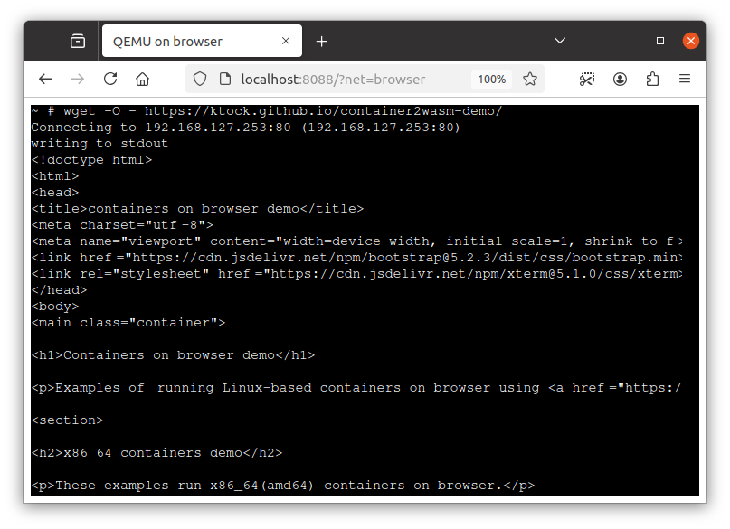
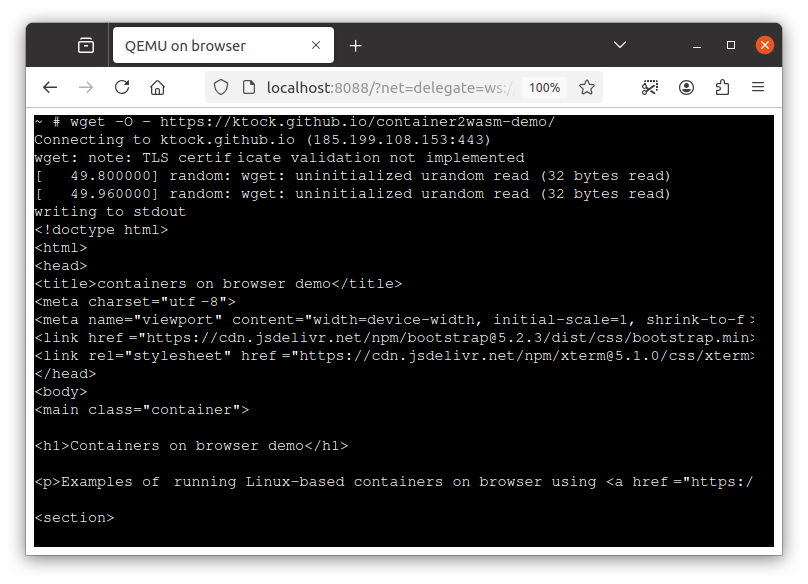

# Enable netwokring on QEMU Wasm

QEMU provides networking functionality.
This feature is still usable on QEMU Wasm.
This document describes how to utilize networking on QEMU Wasm inside browser.

## Step 1: building QEMU Wasm

To build QEMU Wasm, run the following at the repository root directory (they are same steps as written in [`../../README.md`](../../README.md)).

```console
$ docker build -t buildqemu - < Dockerfile
$ docker run --rm -d --name build-qemu-wasm -v $(pwd):/qemu/:ro buildqemu
$ EXTRA_CFLAGS="-O3 -g -Wno-error=unused-command-line-argument -matomics -mbulk-memory -DNDEBUG -DG_DISABLE_ASSERT -D_GNU_SOURCE -sASYNCIFY=1 -pthread -sPROXY_TO_PTHREAD=1 -sFORCE_FILESYSTEM -sALLOW_TABLE_GROWTH -sTOTAL_MEMORY=2300MB -sWASM_BIGINT -sMALLOC=mimalloc --js-library=/build/node_modules/xterm-pty/emscripten-pty.js -sEXPORT_ES6=1 -sASYNCIFY_IMPORTS=ffi_call_js" ; \
  docker exec -it build-qemu-wasm emconfigure /qemu/configure --static --target-list=x86_64-softmmu --cpu=wasm32 --cross-prefix= \
    --without-default-features --enable-system --with-coroutine=fiber --enable-virtfs \
    --extra-cflags="$EXTRA_CFLAGS" --extra-cxxflags="$EXTRA_CFLAGS" --extra-ldflags="-sEXPORTED_RUNTIME_METHODS=getTempRet0,setTempRet0,addFunction,removeFunction,TTY,FS" && \
  docker exec -it build-qemu-wasm emmake make -j $(nproc) qemu-system-x86_64
```

Packaging dependencies:

```console
$ mkdir /tmp/pack/
$ docker build --output=type=local,dest=/tmp/pack/ ./examples/x86_64/image
$ cp ./pc-bios/{bios-256k.bin,vgabios-stdvga.bin,kvmvapic.bin,linuxboot_dma.bin,efi-virtio.rom} /tmp/pack/
$ docker cp /tmp/pack build-qemu-wasm:/
$ docker exec -it build-qemu-wasm /bin/sh -c "/emsdk/upstream/emscripten/tools/file_packager.py qemu-system-x86_64.data --preload /pack > load.js"
```

## Step 2: Start a server

Serve the image as the following (run them at the repository root dir).
This example relies on [c2w-net-proxy.wasm](https://github.com/ktock/container2wasm/tree/da372f28342f73be1857e1ab5f67eae56280b021/extras/c2w-net-proxy) provided by container2wasm project.

```
$ mkdir -p /tmp/test-js/htdocs/
$ cp ./examples/networking/xterm-pty.conf /tmp/test-js/
$ ( cd ./examples/networking/htdocs/ && npx webpack && cp -R index.html arg-module.js dist vendor/xterm.css /tmp/test-js/htdocs/ )
$ wget -O /tmp/c2w-net-proxy.wasm https://github.com/ktock/container2wasm/releases/download/v0.5.0/c2w-net-proxy.wasm
$ cat /tmp/c2w-net-proxy.wasm | gzip > /tmp/test-js/htdocs/c2w-net-proxy.wasm.gzip
$ docker cp build-qemu-wasm:/build/qemu-system-x86_64 /tmp/test-js/htdocs/out.js
$ for f in qemu-system-x86_64.wasm qemu-system-x86_64.worker.js qemu-system-x86_64.data load.js ; do
    docker cp build-qemu-wasm:/build/${f} /tmp/test-js/htdocs/
  done
$ docker run --rm -p 127.0.0.1:8088:80 \
         -v "/tmp/test-js/htdocs:/usr/local/apache2/htdocs/:ro" \
         -v "/tmp/test-js/xterm-pty.conf:/usr/local/apache2/conf/extra/xterm-pty.conf:ro" \
         --entrypoint=/bin/sh httpd -c 'echo "Include conf/extra/xterm-pty.conf" >> /usr/local/apache2/conf/httpd.conf && httpd-foreground'
```

## Step 3: Accessing to the pages

The server started by the above steps provides the following pages.

### `localhost:8088?net=browser` 

This URL serves the image with enabling [networking leveraging Fetch API](https://github.com/ktock/container2wasm/tree/da372f28342f73be1857e1ab5f67eae56280b021/examples/networking/fetch).
This runs a networking stack ([c2w-net-proxy.wasm](https://github.com/ktock/container2wasm/tree/da372f28342f73be1857e1ab5f67eae56280b021/extras/c2w-net-proxy)) inside browser relying on Fetch API for HTTP(S) connection to the outside of the browser.

From [container2wasm documentation](https://github.com/ktock/container2wasm/tree/da372f28342f73be1857e1ab5f67eae56280b021/examples/networking/fetch):

> - pros: No need to run network stack daemon on the host. Networking is done based on browser's Fetch API and follows its security configuration including CORS restriction.
> - cons: Container can send only HTTP/HTTPS packets to outside of the browser. And the set of accesible HTTP/HTTPS sites is limited by the browser's security rule (e.g. limited CORS).

From the guest VM, that networking stack can be seen as a HTTP(S) proxy running inside browser.
When the guest doesn HTTPS connection, the proxy teminates the TLS connection from the guest with its own certificate and re-encrypt the connection to the destination using the Fetch API.
The proxy's certificate is shared to the guest VM via a mount `wasm0`.

In the guest, you can setup the interface as the following.

```
# mount -t tmpfs tmpfs /etc
# touch /etc/hosts /etc/resolv.conf
# udhcpc -i eth0
# mount -t 9p -o trans=virtio wasm0 /mnt -oversion=9p2000.L
# export SSL_CERT_FILE=/mnt/proxy.crt
# export https_proxy=http://192.168.127.253:80
# export http_proxy=http://192.168.127.253:80
# export HTTPS_PROXY=http://192.168.127.253:80
# export HTTP_PROXY=http://192.168.127.253:80
```

The following fetches a page from `https://ktock.github.io/container2wasm-demo/`.

```
# wget -O - https://ktock.github.io/container2wasm-demo/
```



### `localhost:8088?net=delegate=ws://localhost:9999`

This serves the image with enabling [networking leveraging WebSocket API](https://github.com/ktock/container2wasm/tree/da372f28342f73be1857e1ab5f67eae56280b021/examples/networking/websocket/).

On the host, you need to start the network stack listening on the WebSocket (e.g. `localhost:9999`) in advance.
We use `c2w-net` command provided by container2wasm project.
This is available on the [container2wasm release page](https://github.com/ktock/container2wasm/releases).

```
$ c2w-net --listen-ws localhost:9999
```

QEMU Wasm inside browser connects to `c2w-net` over WebSocket and relies on that as a networking stack.

From [container2wasm documentation](https://github.com/ktock/container2wasm/tree/da372f28342f73be1857e1ab5f67eae56280b021/examples/networking/websocket):

> - pros: Container can access to anywhere accesible from the network stack daemon running on the host.
> - cons: The network stack daemon needs to run on the machine and forward packets received over WebSocket.

In the guest, you can setup the interface as the following.

```
# mount -t tmpfs tmpfs /etc
# touch /etc/hosts /etc/resolv.conf
# udhcpc -i eth0
```

The following fetches a page from `https://ktock.github.io/container2wasm-demo/`.

```
# wget -O - https://ktock.github.io/container2wasm-demo/
```


